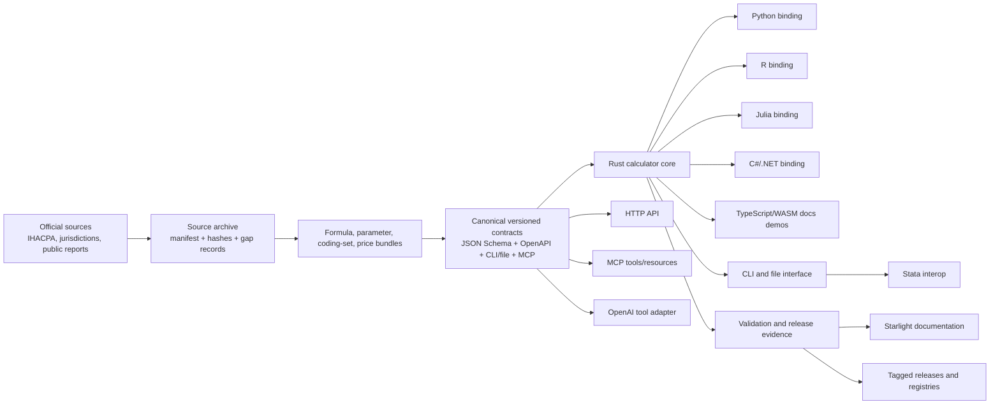
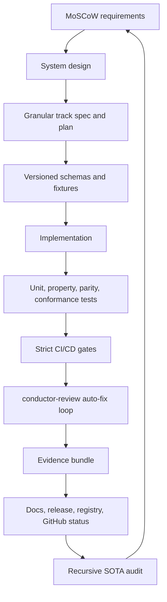
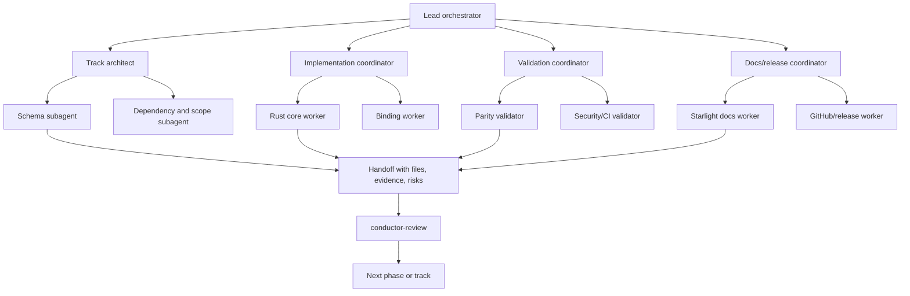
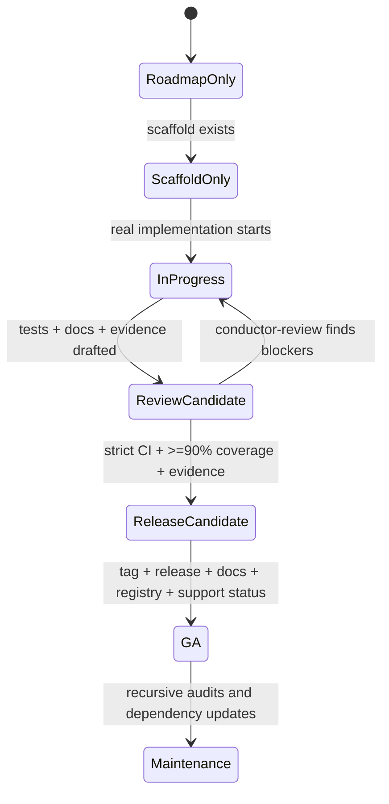
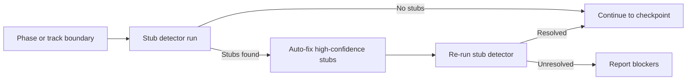

# System Design

Agent coordination note: this file is the design authority for architecture and orchestration. Update it before changing core boundaries, contracts, release gates, or multi-agent execution rules.

## Design Goals

- Make Rust the shared calculator core for GA.
- Keep public behavior contract-first, versioned, and machine-verifiable.
- Preserve researcher workflows through Python, R, Julia, Stata interop, CLI/file contracts, and tutorials.
- Preserve enterprise workflows through C#, API, MCP, OpenAI tool adapter, Power Platform, release automation, and GitHub governance.
- Prevent scaffold-only completion by requiring executable evidence and review loops.
- Enable safe parallel work by splitting tracks into bounded contracts, implementations, validation, docs, and release work packages.

## Architecture Overview



## Contract Enforcement Flow



## Multi-Level Agent Execution Model



## Release and Quality Gates



## Core Design Decisions

| Decision | Current position | Enforcement |
| --- | --- | --- |
| Calculator core | Rust core is the GA target; Python remains a stable consumer during migration. | Rust Core GA and parity tracks. |
| Contract source | Canonical schemas and typed models define behavior; adapters consume them. | Contract enforcement harness and drift tests. |
| Data representation | Arrow/Parquet-friendly file contracts for batch work; JSON for API/tool control planes. | CLI/file and canonical contract tracks. |
| API shape | Domain OpenAPI contract first; OpenAI compatibility only as an adapter/tool surface. | HTTP API and OpenAI adapter tracks. |
| Agent work | Multi-agent work must be granular, owned, reviewed, and evidence-backed. | Subagent orchestration and no-stub enforcement. |
| Docs | Starlight/Astro is the documentation platform. | Docs SOTA Starlight track. |
| GitHub setup | Repository metadata, security, branch protection, releases, package publishing, and Pages are part of Done. | GitHub repo SOTA setup track. |

## Stub Detector Integration

The stub detector (`conductor/scripts/stub_detector.py`) enforces MUST-010 (no stub
completion) and MUST-011 (auto-review loop). It is invoked automatically as part of
the `conductor-review` protocol at every phase and track boundary:



### Invocation Contract

```bash
# Full scan with JSON report for automated consumption
python conductor/scripts/stub_detector.py --root . --json

# Auto-fix high-confidence stubs (downgrade overclaimed track states)
python conductor/scripts/stub_detector.py --root . --fix

# Dry-run to preview fixes
python conductor/scripts/stub_detector.py --root . --fix --dry-run
```

Exit code `0` = no stubs; exit code `1` = stubs detected (blocks advancement).

### Exclusion Mechanisms

Tracks may opt out of stub enforcement by adding one of:

- `"no_stub_enforce": true` in `metadata.json` — for tracks where governance,
  audit, or documentation-only work is the legitimate completion evidence.
- `# no-stub-enforce` (Python) or `// no-stub-enforce` (Rust) at the top of a
  source file — for files that intentionally contain abstract stubs or
  forward declarations.

## Track Cross-Reference Rule

Every new or updated track must reference:

- `conductor/requirements.md` requirement IDs it satisfies.
- `conductor/design.md` design sections or diagrams it changes.
- Explicit contracts it creates or consumes.
- Validation evidence required before completion.
- Whether the track can be parallelised and its subagent ownership boundaries.
